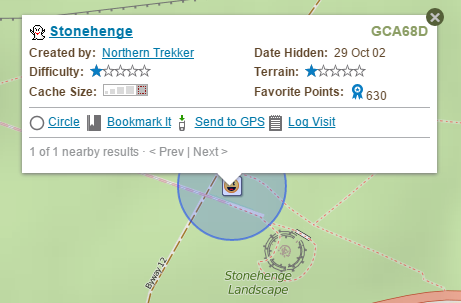

# Geocache Circles

This userscript gives you a convenient way of plotting a 0.1 mile circle around a cache on the Geocaching.com maps page.  This is the minimum spacing allowed between the physical parts of different geocaches.

Once installed, it will add an icon and link to the popup that appears when you click on a geocache.  When you click the link, the script fetches the coordinates for the cache, and plots a circle on the map at those coordinates.  If you have recorded corrected coordinates for the cache, it will plot the cache at those coordinates rather than the original ones.

In order for the script to work, you have to be logged into Geocaching.com (the precise coordinates aren't available otherwise).  You also need a browser that supports the `GM_xmlhttpRequest` function.  This generally means Firefox with the Greasemonkey extension, Chrome with Tampermonkey, or Opera with Violentmonkey.  If you are new to userscripts, there is a [HOWTO](https://openuserjs.org/about/Userscript-Beginners-HOWTO) with instructions on how to get started.
