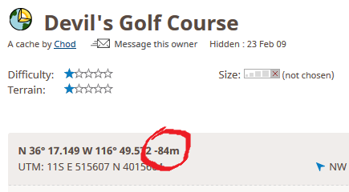

# Geocache Height

This script uses the Google Maps Elevation API to work out the height of a geocache in metres above sea level and adds it alongside the cache's coordinates on its [Geocaching.com](https://www.geocaching.com/) listing page.

I wrote it so that I had a relatively easy way of figuring out which geocache I had found was the highest, without having to pull out the atlas. It's handy if you want to know how high up a mountain you need to climb to find a cache. Unfortunately, it won't help at all if you are trying to figure out how far above or below ground level the cache is actually hidden!

It also works *below* sea level!

If you are new to userscripts, there is a [HOWTO](https://openuserjs.org/about/Userscript-Beginners-HOWTO) with instructions on how to get started.