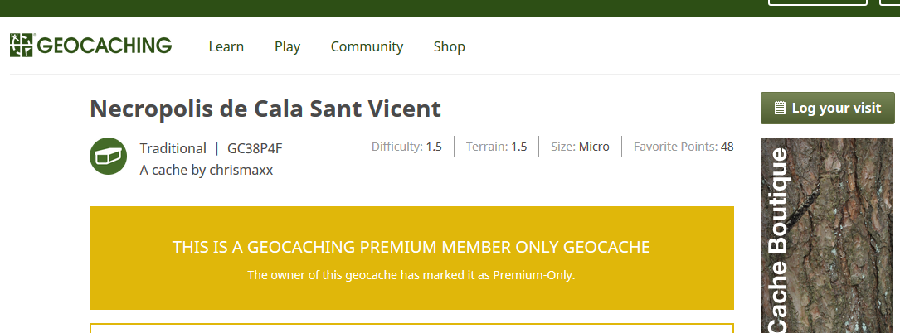

# Log PMO cache

This userscript allows non-Premium Members to log Premium Member Only (PMO) geocaches on [Geocaching.com](https://www.geocaching.com/)

You might wish to do this for one of the following reasons:

  * Your Premium Membership expired before you had a chance to log the cache.
  * The cache became PMO before you had a chance to log it.
  * You found the cache while in the company of Premium Members.
  
Once installed, when you view the cache listing page for a PMO cache, you should see a link taking you to the log entry page for that cache.  The script does not reveal the coordinates, description, clue or anything else that is normally hidden from ordinary members.

Please note that some cache owners may not appreciate logs from non-Premium Members, although - it rather depends on the owner's motivation for making the cache PMO in the first place. If in doubt, explain your situation in your log post. The technique used by the script has been kicking around the [Geocaching Forums](http://forums.groundspeak.com/GC/index.php?showtopic=153834&st=0&p=2667981&#entry2667981) since at least 2007 and seems to be tolerated - if not exactly promoted - by Groundspeak.

If you are new to userscripts, there is a [HOWTO](https://openuserjs.org/about/Userscript-Beginners-HOWTO) with instructions on how to get started.